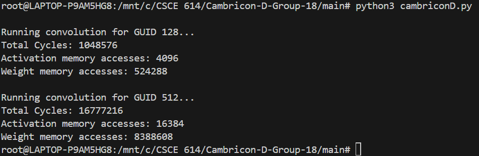
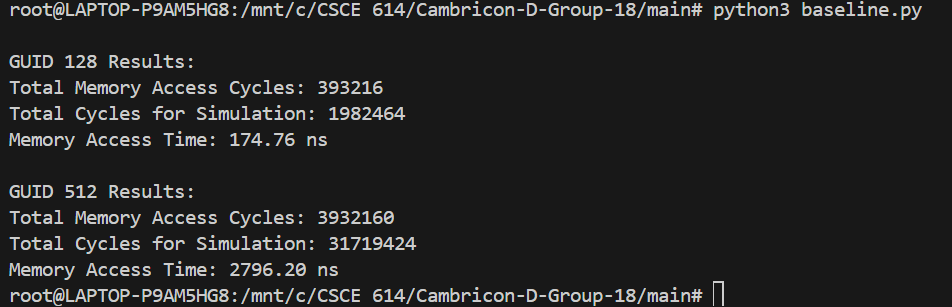

# CSCE-614 TERM PROJECT

## Group 18: Cambricon-D

### Overview
Cambricon-D mainly aims to develop a diffusion model that aims to reduce this redundancy by focusing on differential computation—processing only the variations (or "deltas") between timesteps rather than recalculating the entire dataset each time. It also uses an approach of sign-mask dataflow to lower memory usage while enhancing computational efficiency, achieving significant speed improvements over traditional GPUs like NVIDIA’s A100.

### Implementation
In this project, we have recreated the Cambricon-D's PE-array module usning an analytical model developed in python for the 128 * 128 PE array with 3*3 kernel width and height. The inlier and outliers are also handled separately using quantization modules. The model captures the iterations over the quantization, multipliers, output channels and total main iteration. The weights and inputs are hardcoded using random functions to indicate variability in the inputs.

A baseline code is also created to compare the performance i.e number of cycles and memory utilization over Cambricon-D's PE array. The baseline code computes the total computation cycles and the memory access cycles and the memory access time for a generic PE array.

### Directory Structure
1. `\main` Required source code for execution
2. `\CambriconD` Contains code developed using SystemVerilog and python as a foundation and backup codes.
3. `\Screenshots` Images used for readme and reports
4. `\SYS_VERILOG_CODES` All System Verilog Codes Implemented and checked against TB as the paper is implemented in SV.
5. `\outputs` Output log files of baseline code and CambriconD. Executed using python's builtin logger. For e.g. `python3 example_file.py > output.log`.
   
### Steps to run the code
1. `cd \main` Set the main to main.

2. `python3 CambriconD.py` to simulate Cambricon-D's PE array simulation.

3. `python3 baseline.py` to simulate baseline code.

### Results
Upon comparing computation of the PE-array with the baseline code, a speedup of around 1.89 was observed for the Cambricon-D for GUID-128 and GUID 512. The average memory accesses observed for Cambricon-D was roughly 1.3 times the baseline configuration for GUID-128 and 2.1 times higher for GUID-512 which matched the expected results.

#### Cambricon-D sample result

#### Baseline code sample result

#### GUID-128 Result:
##### Comparing the speedup 
`Clock cycles of baseline:` 1982464

`Clock cycles of Cambricon-D:` 1048576

`Speedup` = Clock cycles of baseline/clock cycles of Cambricon-D = 1.89

##### Comparing the memory access cycles

`Memory accesses of Cambricon-D` = Activation memory accesses+ weight memory accesses

`Memory accesses of Cambricon-D` = 4096 + 524288 = 528384

`Memory access cycles:` 393216

`Memory access ratio` = 528384/393216 = 1.34375

#### GUID-512 Result:
##### Comparing the speedup 
`Clock cycles of baseline:` 31719424

`Clock cycles of Cambricon-D:` 16777216

`Speedup` = Clock cycles of baseline/clock cycles of Cambricon-D = 1.89

##### Comparing the memory access cycles

`Memory accesses of Cambricon-D:` = Activation memory accesses+ weight memory accesses

`Memory accesses of Cambricon-D:` 16384 + 8388608 = 8404992

`Memory access cycles:` 3932160

`Memory access ratio` = 528384/393216 = 2.13

### Team Members
1. Avinash Singh (avinsing7@tamu.edu)
2. Shubham Kumar (shubkumr7@tamu.edu)
3. Shubham Santosh Kumar (shubham1384@tamu.edu)
4. Athul John Kurian (athuljohnkurian@tamu.edu)

### Reference links
Link to presentation: [Google drive](https://drive.google.com/file/d/1liyCmfI8VIcpWymhqgCrzI_1B8yQYHUw/view?usp=sharing)

## IMPORTANT NOTE

We were working on GIT directory "https://github.com/Avinash-Tamu/CSCE-614-FA24-Term-Project.git" and performed all the necessary git operations, including push and pull. Later, We created this working Git repo and transferred all the files.

